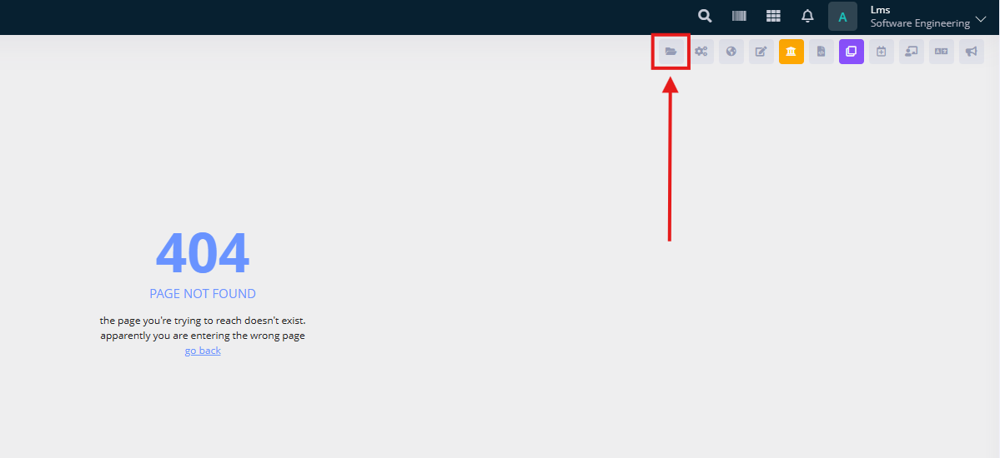
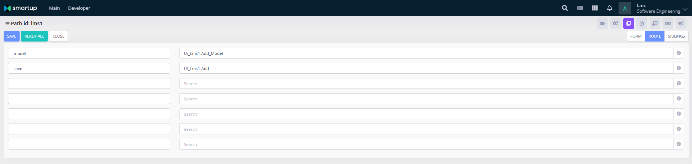

# Forms

We have already created the tables and API packages. Now it's time to build the user interface for our project. This involves several steps:

1. Create the form using Biruni UI.
2. Create a UI package in Oracle.
3. Create the HTML file for the form.

There are common form types in Biruni based projects. These are list, add, edit, view forms. In our project we are mostly going to create these type of forms as well, except we are going to skip onto view forms.

We will create add, edit, and list forms for **subjects**, **rooms**, **students**, **teachers**, and **courses**.\
For **teacher\_subjects** and **course\_students**, we will implement list forms with **attach/detach** functionality.\
Lastly, we will create a unique list form for **lessons**. Lessons are auto-generated when courses are created, and they can be edited directly from the list form using a **modal window**.

We are going to start the forms with subjects with detailed steps:

1. Navigate to Developer -> Form -> Forms page, then click to the `Add` button to create new form.
2. Fill the form url input with `/lms/cr/subject+add`, this will be form which adds subject to the `cr_subjects` table.
3. Set access position to the `Form`.
4. Save the form.

<figure><figcaption></figcaption></figure>

5.  Create a **UI package** for **subjects** that includes both **add** and **edit** route actions.

    To do this:

    * Create a file named `subject.pck` in the directory: `lms/main/oracle/ui/lms/cr/`
    * The **package name** must be saved in the database using the **path code** generated by the form.

    Steps:

    1. Copy the **form URL** you created earlier and open it in a browser.
    2. Use the **Developer Toolbar** and go to **Form Info**.
    3. Locate the `path_id` as shown in the reference image.
    4. The UI package name for the `subject``+add` route will be:\
       &#xNAN;**`ui_lms1`**.

<figure><figcaption></figcaption></figure>

6. We are going to create the **add** and **edit** actions in the `subject.pck`, which will utilize the `cr_api.pck` API functions to save the data. Additionally, we need to include **model procedures** for both the **add** and **edit** routes to provide the initial data when the page is first opened.

```sql
----------------------------------------------------------------------------------------------------
Function Add_Model return Hashmap is
begin
  return Fazo.Zip_Map('state', 'A');
end;

----------------------------------------------------------------------------------------------------  
Function Edit_Model(p Hashmap) return Hashmap is
  r_Data Cr_Subjects%rowtype;
begin
  r_Data := z_Cr_Subjects.Load(i_Company_Id => Ui.Company_Id,
                                i_Subject_Id => p.r_Number('subject_id'));

  return z_Cr_Subjects.To_Map(r_Data, z.Subject_Id, z.Name, z.Note, z.State);
end;

----------------------------------------------------------------------------------------------------  
Procedure Add(p Hashmap) is
  r_Data Cr_Subjects%rowtype;
begin
  z_Cr_Subjects.To_Row(r_Data, p, z.Name, z.State, z.Note);

  r_Data.Company_Id := Ui.Company_Id;
  r_Data.Subject_Id := Cr_Next.Subject_Id;

  Cr_Api.Subject_Save(r_Data);
end;

----------------------------------------------------------------------------------------------------  
Procedure Edit(p Hashmap) is
  r_Data Cr_Subjects%rowtype;
begin
  r_Data       := z_Cr_Subjects.Lock_Load(i_Company_Id => Ui.Company_Id,
                                          i_Subject_Id => p.r_Number('subject_id'));
  r_Data.Name  := p.r_Varchar2('name');
  r_Data.Note  := p.r_Varchar2('note');
  r_Data.State := p.r_Varchar2('state');

  Cr_Api.Subject_Save(r_Data);
end;
```

7. Create the corresponding file in the LMS project directory: `lms/main/page/form/cr/subject.html`.\
   This `subject.html` file includes both **add** and **edit** functionalities, each accessible through different routes. Alternatively, you can simply click the **Developer Toolbar** button, which automatically generates the HTML file and opens it in the selected editor.

<figure><figcaption><p>Open via Developer toolbar</p></figcaption></figure>

8. Below is the HTML file for the form, which supports both **add** and **edit** routes simultaneously.


```html
<script biruni>
page.ctrl(function (scope, model) {
  var d = model || {};
  function save() {
    if (page.valid(scope.form)) {
      let data = _.pick(d, 'subject_id', 'name', 'note', 'state');
      page.post(':save', data).then(page.close, page.alert);
    }
  }

  scope.d = d;
});
</script>

<div class="b-toolbar">
  <button type="button" class="btn btn-primary" ng-click="save()" b-hotkey="save">save</button>
  <button type="button" class="btn btn-default" ng-click="page.close()">{{page.close.title}}</button>
</div>
<div class="b-content">
  <form name="form">
    <div class="form-row">
      <div class="col-sm-12">
        <div class="card card-custom">
          <div class="card-body">
            <div class="form-group">
              <label>name</label>
              <input class="form-control" ng-model="d.name" required b-maxlength="100" />
            </div>
            <div class="form-group">
              <label>note</label>
              <input class="form-control" ng-model="d.note" b-maxlength="200" />
            </div>
            <div class="form-group">
              <label>state</label><br/>
              <label class="switch">
                <input type="checkbox" ng-true-value="'A'" ng-false-value="'P'" ng-model="d.state"/>
                <span>
                  <t ng-if="d.state == 'A'">active</t>
                  <t ng-if="d.state == 'P'">passive</t>
                </span>
              </label>
            </div>
          </div>
        </div>
      </div>
    </div>
  </form>
</div>
```


9. Lastly, to connect the routes, open the **Developer Toolbar**, go to **Form Info**, and navigate to the **Route** tab.

<figure><figcaption><p>/lms/cr/subject+add routes</p></figcaption></figure>

10. Add the `/lms/cr/subject+edit` form, just like we did for `subject+add`.

    The only difference is the routes it connects to:

    * Use `Ui_Lms1.Edit_Model` for the `:model`
    * Use `Ui_Lms1.Edit` for the `:save`
11. To display subjects, we need a `subject_list` form.

    Steps:

    1. Create the form via the **Developer menu**.
    2. Generate the corresponding **HTML file** (`subject_list.html`).
    3. Create the **UI package** (e.g., `subject_list.pck`) in `lms/main/oracle/ui/lms/cr/`.

    This form will be used to **list all subjects** and support features such as **filtering**, **sorting**, **searching**, and **add/edit/delete** buttons for managing subjects.


```sql
----------------------------------------------------------------------------------------------------
Function Query_Subjects return Fazo_Query is
  q Fazo_Query;
begin
  q := Fazo_Query('cr_subjects', Fazo.Zip_Map('company_id', Ui.Company_Id), true);

  q.Number_Field('subject_id');
  q.Varchar2_Field('name', 'state', 'note');

  q.Option_Field('state_name',
                  'state',
                  Array_Varchar2('A', 'P'),
                  Array_Varchar2(Ui.t_Active, Ui.t_Passive));

  return q;
end;

----------------------------------------------------------------------------------------------------
Procedure Del(p Hashmap) is
  v_Subject_Ids Array_Number := p.r_Array_Number('subject_id');
begin
  for i in 1 .. v_Subject_Ids.Count
  loop
    Cr_Api.Subject_Delete(i_Company_Id => Ui.Company_Id, i_Subject_Id => v_Subject_Ids(i));
  end loop;
end;
```



```html
<script biruni>
page.init(function () {
  page.isInit() && page.query('subjects').filter('state', '=', 'A');

  var stateClass = { A: 'success', P: 'danger' };
  page.grid('subjects').asHtml('state_html', 'state, state_name', row => {
    return `<div class="alert alert-custom alert-light-${stateClass[row.state]} text-center py-1 px-3 m-0"><div class="alert-text">${row.state_name}</div></div>`;
  });
});
page.ctrl(function (scope, model, fi, t) {
  var q = {};

  function closeIfDialog(result) {
    if (page.isDialog()) page.close(result);
  }

  function add() {
    fi.add(null, closeIfDialog);
  }

  function deleteOne(row) {
    page.confirm(t('delete subject $1?')(row.name), function () {
      fi.delete({ subject_id: row.subject_id }).then(page.reload, page.alert);
    });
  }

  function deleteMany() {
    page.confirm(t('delete $1 subject(s)?')(q.checked.size), function () {
      fi.delete({ subject_id: _.pluck(q.checked.rows(), 'subject_id') }).then(page.reload, page.alert);
    });
  }

  function edit(row) {
    fi.edit({ subject_id: row.subject_id }, closeIfDialog);
  }

  function onDblclick(row) {
    page.isDialog() ? page.close(row) : fi.edit ? edit(row) : null;
  }

  function onCheck(checked) {
    q.checked = checked;
  }

  scope.q = q;
});
</script>
<div class="b-toolbar row">
  <div class="col-sm-14">
    <button type="button" class="btn btn-success" ng-click="add()" ng-if="fi.add" b-hotkey="add">{{ fi.add.title }}</button>
    <button type="button" class="btn btn-default px-4" ng-click="audit()" ng-if="fi.audit" b-toggle="tooltip" title="{{ fi.audit.title }}" data-placement="bottom">
      <i class="fas fa-history p-0"></i>
    </button>
    <button type="button" class="btn btn-danger" ng-click="deleteMany()" ng-if="fi.delete" ng-show="q.checked.has" b-hotkey="delete">
      <t p1="q.checked.size">delete $1</t>
    </button>
    <button type="button" class="btn btn-default" ng-click="page.close()" ng-hide="page.isFirst()">{{ page.close.title }}</button>
  </div>
  <div class="col-sm-10 b-right">
    <b-grid-controller name="subjects" />
  </div>
</div>
<div class="b-content">
  <form name="form">
    <b-grid name="subjects" required="subject_id, name" on-check="onCheck(checked)" on-dblclick="onDblclick(row)"
            sort="name" search="name" searchable="subject_id" extra-columns="subject_id">
      <b-row>
        <b-col name="name" size=7 />
        <b-col name="state_name" as-html="state_html" size="4" />
      </b-row>

      <b-action>
        <button type="button" class="btn btn-default" ng-click="edit(row)" ng-if="fi.edit">{{ fi.edit.title }}</button>
        <button type="button" class="btn btn-default" ng-click="deleteOne(row)" ng-if="fi.delete">{{ fi.delete.title }}</button>
        <button type="button" class="btn btn-default" ng-click="page.close(row)" ng-if="page.isDialog()"><t>select</t></button>
      </b-action>

      <b-filter name="state" />
    </b-grid>
  </form>
</div>
```


12. For the list form add form actions from **Form info**:
    1. `Add` button opens `/lms/cr/subject+add` form from the list
    2. `Edit` button will be enabled for each single row in the list
    3.  The `Delete` button will be available for each subject in the list form.

        In the Routes tab, it must be connected to the `Delete` procedure of the corresponding UI package.

<figure><figcaption></figcaption></figure>

#### Translates

Check out [this guide](../views/translate.md) to add translate support for the forms. After translating the page and save, there will be auto generated JSON and SQL files.

***

Now that you've seen a complete example of how to create a form, including both UI and backend integration, you can use this as a reference to build the remaining forms in your project. Follow the same structure for other forms as well.
