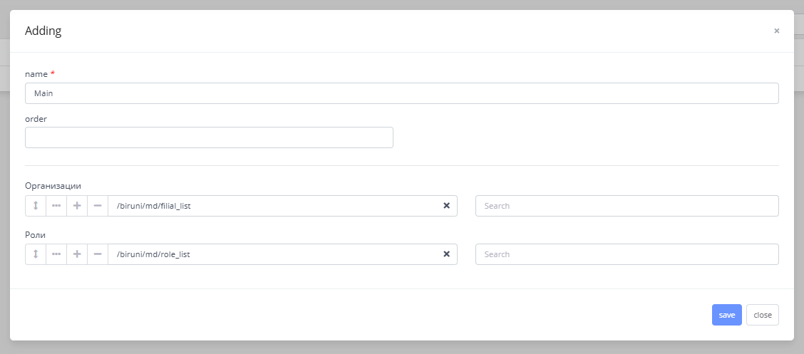

---
layout:
  title:
    visible: true
  description:
    visible: false
  tableOfContents:
    visible: true
  outline:
    visible: true
  pagination:
    visible: true
---

# Project setup

## Initial steps

First, install development version of Biruni using [Tomcat deployment guide](../getting-started/quickstart/#id-2.-using-tomcat).

We will create our LMS project in the same projects directory where Biruni is located. This directory is specified in `application.properties` under the key: `biruni.dev.projects.folder`.

## Installing LMS project

Next, we need to create the directories and files listed [here](architecture.md#folder-structure). After that, we should create the `lms.pck` file inside the `lms/main/oracle/setup` folder, which will contain the project version and code definitions.


```plsql
create or replace package Lms is
  ----------------------------------------------------------------------------------------------------
  Function Version return varchar2 deterministic;
  ----------------------------------------------------------------------------------------------------
  Function Project_Code return varchar2 deterministic;
end Lms;
/
create or replace package body Lms is
  ----------------------------------------------------------------------------------------------------
  Function Version return varchar2 deterministic is
  begin
    return '1.0.0';
  end;

  ----------------------------------------------------------------------------------------------------
  Function Project_Code return varchar2 deterministic is
  begin
    return 'lms';
  end;

end Lms;
/
```


Now, inside the `setup` directory, create an `init` folder. This folder holds SQL scripts related to the current project (e.g., `project.sql`, `job.sql`, `watcher.sql`, etc.).\
In our case, we will create `project.sql`, which installs the LMS project into the schema.


```plsql
prompt lms project
declare
  v_Project_Code varchar2(10) := Lms.Project_Code;
begin
  update Md_Projects t
     set t.Visible = 'N'
   where t.Project_Code in (Biruni.Project_Code);
   
  z_Md_Projects.Save_One(i_Project_Code      => v_Project_Code,
                         i_Path_Prefix_Set   => v_Project_Code,
                         i_Module_Prefix_Set => 'cr',
                         i_Intro_Form        => '/lms/intro/dashboard',
                         i_Visible           => 'Y',
                         i_Parent_Code       => Biruni.Project_Code,
                         i_Version           => Lms.Version);
  commit;
end;
/
```


[Execute](../getting-started/quickstart/maven-setup-guide.md#database-installation-steps) `lms.pck` first, followed by `project.sql`. You can verify the project installation from the `md_projects` table.

## Filial and Roles setup

Later in the guide, we will create teacher and student users using Biruni's built-in user system, which supports authentication and role-based access control. Biruni requires that every user be linked to at least one filial (organization). Therefore, we need to create new organizations for teachers and students.

### Create menus

We are going to start by adding the necessary organization and role forms to the menu for quick access.

1. Navigate to Developer → Form → Projects

<figure><figcaption></figcaption></figure>

2. Go to `Menus` form of `lms` project, then create first layer menu with any name (e.g. `Main`).
3. Open the `child menus` of the menu you just created. This will allow you to add a second layer of menus, including child form menus.
4. Now, add the following form menus as shown in the image below:

* `/biruni/md/filial_list`
* `/biruni/md/role_list`

<figure><figcaption></figcaption></figure>

### Create new filial

Go to Main → Organizations from the menu you just added. In the `filial_list` form, you’ll see the `Администрирование` head filial, which exists by default for each company. Now, we’ll create a new filial for our users. You may choose any appropriate name for the new filial. (e.g. `Software Engineering`)

### Create new roles

We need to create `Teacher` and `Student` roles to manage access permissions, as each has different privileges. Go to Main → Roles from the menu, which opens the `role_list` form, from there you can add new roles.

