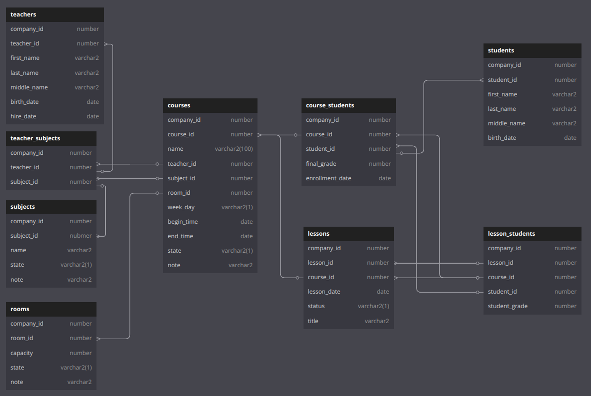

# Table structure

In order to build the courses module, several database tables are required.

<figure><figcaption></figcaption></figure>

## Description

The structure shown in the diagram is essential for the **Courses Module** to manage all aspects of course planning and tracking. Here's why each part is needed:

* **`courses`** is the core, defining each course along with its assigned teacher, subject, room, schedule, and status.
* **`teachers`**, **`subjects`**, and **`rooms`** provide necessary details and constraints to assign valid combinations for a course.
* **`teacher_subjects`** ensures teachers are only assigned to subjects they are qualified to teach.
* **`students`** and **`course_students`** enable tracking of student enrollments and final grades for each course.
* **`lessons`** break down courses into individual sessions for better scheduling and attendance tracking.
* **`lesson_students`** tracks student participation and performance per lesson, giving detailed insight beyond course-level grades.

## Creating tables

We are going to create the tables shown above in order, where each table will include the required columns and constraints such as primary key, foreign key, NOT NULL, and so on.

Since the module we are working on is the "cr" module, all tables under this module are prefixed with `cr_`. Additionally, each table includes a `company_id` column to support multi-tenancy, ensuring that data is isolated and identifiable per company within the shared database structure.

### Reference tables

`cr_rooms` table stores information about physical classrooms or learning spaces.

```sql
create table cr_rooms(
  company_id                      number(20)  not null,
  room_id                         number(20)  not null,
  capacity                        number(20)  not null,
  state                           varchar2(1) not null,
  note                            varchar2(1000 char),
  constraint cr_rooms_pk primary key (company_id, room_id) using index tablespace GWS_INDEX,
  constraint cr_rooms_u1 unique (room_id) using index tablespace GWS_INDEX,
  constraint cr_rooms_c1 check (state in ('A', 'P'))
) tablespace GWS_DATA;

comment on column cr_rooms.state is '(A)ctive, (P)assive';
```

`cr_subjects` table stores catalog of academic subjects or courses offered. The table has its sequence as well.

```sql
create table cr_subjects(
  company_id                      number(20)         not null,
  subject_id                      number(20)         not null,
  name                            varchar2(100 char) not null,
  state                           varchar2(1)        not null,
  note                            varchar2(1000 char),
  constraint cr_subjects_pk primary key (company_id, subject_id) using index tablespace GWS_INDEX,
  constraint cr_subjects_u1 unique (subject_id) using index tablespace GWS_INDEX,
  constraint cr_subjects_u2 unique (name) using index tablespace GWS_INDEX,
  constraint cr_subjects_c1 check (name = trim(name)),
  constraint cr_subjects_c2 check (state in ('A', 'P'))
) tablespace GWS_DATA;

comment on column cr_subjects.state is '(A)ctive, (P)assive';

create sequence cr_subjects_sq;
```

### Entity tables

```sql
create table cr_teachers(
  company_id                      number(20)        not null,
  teacher_id                      number(20)        not null,
  first_name                      varchar2(80 char) not null,
  last_name                       varchar2(80 char),
  middle_name                     varchar2(80 char),
  birth_date                      date,
  hire_date                       date,
  constraint cr_teachers_pk primary key (company_id, teacher_id) using index tablespace GWS_INDEX,
  constraint cr_teachers_f1 foreign key (company_id, teacher_id) references md_users(company_id, user_id),
  constraint cr_teachers_c1 check (first_name = trim(first_name)),
  constraint cr_teachers_c2 check (last_name = trim(last_name)),
  constraint cr_teachers_c3 check (middle_name = trim(middle_name))
) tablespace GWS_DATA;
```

```sql
create table cr_students(
  company_id                      number(20)        not null,
  student_id                      number(20)        not null,
  first_name                      varchar2(80 char) not null,
  last_name                       varchar2(80 char),
  middle_name                     varchar2(80 char),
  birth_date                      date,
  constraint cr_students_pk primary key (company_id, student_id) using index tablespace GWS_INDEX,
  constraint cr_students_f1 foreign key (company_id, student_id) references md_users(company_id, user_id),
  constraint cr_students_c1 check (first_name = trim(first_name)),
  constraint cr_students_c2 check (last_name = trim(last_name)),
  constraint cr_students_c3 check (middle_name = trim(middle_name))
) tablespace GWS_DATA;
```

### Relationship tables

`cr_teacher_subjects` table stores many-to-many link between teachers and subjects.

```sql
create table cr_teacher_subjects(
  company_id                      number(20) not null,
  teacher_id                      number(20) not null,
  subject_id                      number(20) not null,
  constraint cr_teacher_subjects_pk primary key (company_id, teacher_id, subject_id) using index tablespace GWS_INDEX,
  constraint cr_teacher_subjects_f1 foreign key (company_id, teacher_id) references cr_teachers(company_id, teacher_id) on delete cascade,
  constraint cr_teacher_subjects_f2 foreign key (company_id, subject_id) references cr_subjects(company_id, subject_id) on delete cascade
) tablespace GWS_DATA;
```

### Course tables

`cr_courses` table defines course offerings with assigned teacher, subject, room, and schedule. Contains core course configuration and status information. We are creating new sequence for courses as well.

```sql
create table cr_courses(
  company_id                      number(20)    not null,
  course_id                       number(20)    not null,
  name                            varchar2(100) not null,
  teacher_id                      number(20)    not null,
  subject_id                      number(20)    not null,
  room_id                         number(20)    not null,
  week_day                        varchar2(1)   not null,
  begin_time                      date,
  end_time                        date,
  state                           varchar2(1)   not null,
  note                            varchar2(1000 char),
  constraint cr_courses_pk primary key (company_id, course_id) using index tablespace GWS_INDEX,
  constraint cr_courses_u1 unique (course_id) using index tablespace GWS_INDEX,
  constraint cr_courses_u2 unique (company_id, name) using index tablespace GWS_INDEX,
  constraint cr_courses_f1 foreign key (company_id, teacher_id, subject_id) references cr_teacher_subjects(company_id, teacher_id, subject_id),
  constraint cr_courses_f2 foreign key (company_id, room_id) references cr_rooms(company_id, room_id),
  constraint cr_courses_c1 check (week_day in ('O', 'E', 'A')),
  constraint cr_courses_c2 check (state in ('A', 'P'))
) tablespace GWS_DATA;

comment on column cr_courses.week_day  is '(O)dd: Monday, Wednesday, Friday, (E)ven: Tuesday, Thursday, Saturday, (A)ll: odd + even';
comment on column cr_courses.state     is '(A)ctive, (P)assive';

create sequence cr_courses_sq;
```

`cr_course_students`: Student enrollment records with final grades and enrollment dates. Represents the complete student-course relationship over the duration of the course.

```sql
create table cr_course_students(
  company_id                      number(20) not null,
  course_id                       number(20) not null,
  student_id                      number(20) not null,
  final_grade                     number(6,2),
  enrollment_date                 date,
  constraint cr_course_students_pk primary key (company_id, course_id, student_id) using index tablespace GWS_INDEX,
  constraint cr_course_students_f1 foreign key (company_id, course_id) references cr_courses(company_id, course_id) on delete cascade,
  constraint cr_course_students_f2 foreign key (company_id, student_id) references cr_students(company_id, student_id) on delete cascade
) tablespace GWS_DATA;
```

### Lesson tables

`cr_lessons` table stores individual class sessions scheduled for specific dates within a course. Tracks status as planned, completed, or canceled. There is also lesson sequence created for the table.

```sql
create table cr_lessons(
  company_id                      number(20)  not null,
  lesson_id                       number(20)  not null,
  course_id                       number(20)  not null,
  lesson_date                     date        not null,
  status                          varchar2(1) not null,
  title                           varchar2(100 char),
  constraint cr_lessons_pk primary key (company_id, lesson_id) using index tablespace GWS_INDEX,
  constraint cr_lessons_u1 unique (lesson_id) using index tablespace GWS_INDEX,
  constraint cr_lessons_u2 unique (course_id, lesson_date) using index tablespace GWS_INDEX,
  constraint cr_lessons_f1 foreign key (company_id, course_id) references cr_courses(company_id, course_id) on delete cascade,
  constraint cr_lessons_c1 check (status in ('P', 'D', 'C'))
) tablespace GWS_DATA;

comment on column cr_lessons.status is '(P)lanned, (D)one, (C)ancelled';

create sequence cr_lessons_sq;
```

`cr_lesson_students` table to track student attendance and performance for specific lessons. Records individual lesson grades that contribute to the final course grade.

```sql
create table cr_lesson_students(
  company_id                      number(20) not null,
  lesson_id                       number(20) not null,
  course_id                       number(20) not null,
  student_id                      number(20) not null,
  student_grade                   number(6,2),
  note                            varchar2(100),
  constraint cr_lesson_students_pk primary key (company_id, lesson_id, student_id) using index tablespace GWS_INDEX,
  constraint cr_lesson_students_f1 foreign key (company_id, lesson_id) references cr_lessons(company_id, lesson_id) on delete cascade,
  constraint cr_lesson_students_f2 foreign key (company_id, course_id, student_id) references cr_course_students(company_id, course_id, student_id) on delete cascade
) tablespace GWS_DATA;
```

### Z package

The tables provided above meet all the requirements of the courses module. After creating all the tables and sequences in the specified order, we need to generate a Z package for these tables to simplify future DML operations:

```sql
execute fazo_z.run();
-- or execute it for only cr module, rather than global
execute fazo_z.run('cr');
```
